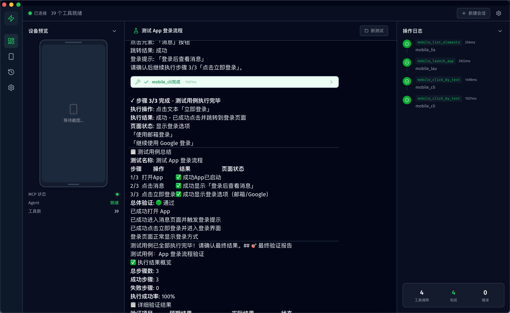

# 📱 Mobile MCP Agent

> 移动端 AI 自动化测试平台 —— MCP 工具 + AI Agent + 可视化操控台

<div align="center">

[](https://pypi.org/project/mobile-mcp-ai/)
[](https://www.python.org/)
[](LICENSE)
[](https://developer.android.com/)
[](docs/iOS_SETUP_GUIDE.md)

**⭐ 觉得有用？给个 Star 支持一下！**

**📱 支持 Android 和 iOS 双平台**

[English](README_EN.md)

</div>

---

## 📖 项目简介

Mobile MCP Agent 是一个移动端 AI 自动化测试平台，包含三个可独立使用的层次：

| 层次 | 说明 | 技术栈 | 文档 |
|:---:|------|------|:---:|
| **MCP Server** | 39 个移动端自动化工具，可独立配合 Cursor / Claude 使用 | Python · MCP 协议 · PyPI | [MCP 文档](docs/MCP_README.md) |
| **AI Agent** | 智能测试执行引擎，自动编排工具调用、范式降级、结果验证 | LangChain · LangGraph | [Agent 文档](agent-app/README.md) |
| **Electron 操控台** | 可视化界面，设备预览、测试流程编排、实时操作日志 | Electron · React · TailwindCSS | 本文档 |

> **只想用 MCP 工具配合 Cursor / Claude？** 请直接查看 👉 [MCP 使用文档](docs/MCP_README.md)

---

## 🎬 演示

<div align="center">


*[查看高清视频 →](docs/videos/demo.mp4)*

</div>

<div align="center">



*Agent 自动化测试执行效果*

</div>

---

## ✨ 核心特性

<table>
<tr>
<td width="50%">

### 🧠 AI Agent 智能执行

基于 LangChain + LangGraph 的测试 Agent，自动编排工具调用，按步骤执行测试用例

</td>
<td width="50%">

### 🔄 三范式自动降级

元素交互 → SoM 视觉 → 坐标定位，逐级降级，确保操作成功率

</td>
</tr>
<tr>
<td width="50%">

### 🖥️ 可视化操控台

Electron 桌面应用，设备实时预览、测试流程编排、操作日志时间轴

</td>
<td width="50%">

### 🔧 MCP 工具独立可用

39 个工具通过 `pip install mobile-mcp-ai` 安装，可直接配合 Cursor / Claude 使用

</td>
</tr>
<tr>
<td width="50%">

### 🎯 双平台支持

Android + iOS 双平台，元素树 + 视觉坐标双引擎

</td>
<td width="50%">

### 🛡️ 智能验证机制

操作结果自动验证，前置条件检查，测试报告自动生成

</td>
</tr>
</table>

---

## 📱 平台支持

| 平台 | 支持状态 | 系统要求 | 配置指南 |
|:---:|:---:|:---:|:---:|
| **Android** | ✅ 完整支持 | Windows / macOS / Linux | 开箱即用 |
| **iOS** | ✅ 完整支持 | macOS（必须） | [iOS 配置指南 →](docs/iOS_SETUP_GUIDE.md) |

---

## 🏗️ 系统架构

```
┌──────────────────────────────────────────────────────┐
│              Electron 操控台 (frontend/)              │
│        React · TailwindCSS · Shadcn UI · oRPC        │
│   设备预览 · 测试编排 · 聊天交互 · 操作日志时间轴      │
└──────────────────┬───────────────────────────────────┘
                   │ HTTP / SSE
┌──────────────────▼───────────────────────────────────┐
│              AI Agent (agent-app/)                     │
│     LangChain · LangGraph · FastAPI · SSE Stream      │
│  智能编排 · 范式降级 · 截图优化 · 操作日志 · 重试机制   │
└──────────────────┬───────────────────────────────────┘
                   │ MCP 协议 (stdio)
┌──────────────────▼───────────────────────────────────┐
│            MCP Server (pip install mobile-mcp-ai)     │
│           39 个移动端自动化工具 · Android + iOS         │
└──────────────────┬───────────────────────────────────┘
                   │ ADB / WebDriverAgent
              📱 移动设备
```

---

## 🚀 快速开始

### 前置条件

| 工具 | 用途 | 安装 |
|------|------|------|
| **Python 3.8+** | MCP Server & Agent | [python.org](https://www.python.org/) |
| **Node.js 18+** | Electron 操控台 | [nodejs.org](https://nodejs.org/) |
| **pnpm** | 前端包管理 | `npm install -g pnpm` |
| **uv** | Agent 依赖管理 | `pip install uv` |
| **ADB** | Android 设备连接 | Android SDK Platform Tools |
| **Git** | 源码获取 | [git-scm.com](https://git-scm.com/) |

### 第一步：克隆项目

```bash
git clone https://gitee.com/cong_wa/mobile-mcp.git
cd mobile-mcp
```

### 第二步：连接移动设备

**Android 用户：**
```bash
# 开启手机 USB 调试，用数据线连接电脑
adb devices
# 看到设备列表即连接成功
```

**iOS 用户：**
```bash
# 安装依赖
pip install tidevice facebook-wda
brew install libimobiledevice

# 检查连接
tidevice list
```

> 📖 iOS 需要额外配置 WebDriverAgent，详见 [iOS 配置指南](docs/iOS_SETUP_GUIDE.md)

### 第三步：启动 MCP Server（SSE 模式）

Agent 和 Electron 操控台都需要 MCP Server 以 SSE 模式运行：

```bash
# 安装 MCP Server
pip install mobile-mcp-ai

# 以 SSE 模式启动（默认端口 3100）
mobile-mcp --sse
```

> 💡 SSE 模式下 MCP Server 会在 `http://localhost:3100/sse` 提供服务

### 第四步：启动 AI Agent 后端

```bash
cd agent-app

# 复制并编辑配置文件
cp .env.example .env
# 编辑 .env，填入 LLM API Key（必填）
```

`.env` 关键配置：

```bash
# LLM 配置（必填）
LLM_MODEL=openai:gpt-4o          # 模型，格式: provider:model
LLM_API_KEY=sk-xxx                # API Key
LLM_BASE_URL=https://api.openai.com/v1  # API 地址

# Agent 服务器
AGENT_HOST=0.0.0.0
AGENT_PORT=8088
```

启动 Agent：

```bash
# 安装依赖
uv sync

# 启动 Agent HTTP 服务
uv run uvicorn mobile_agent.api.app:app --host 0.0.0.0 --port 8088
```

Agent 启动后会自动通过 stdio 连接 MCP Server。

### 第五步：启动 Electron 操控台

```bash
cd frontend

# 安装依赖
pnpm install

# 启动开发模式
pnpm start
```

操控台默认连接 `http://localhost:8088/api/v1`，如需修改，可在操控台的**设置页面**中更改后端地址。

---

## ⚙️ 部署配置

### 后端服务地址配置

Electron 操控台需要连接 AI Agent 后端服务，支持以下配置方式（优先级从高到低）：

| 方式 | 说明 | 适用场景 |
|------|------|------|
| **操控台设置页面** | 在 UI 中直接修改后端地址（保存到 localStorage） | 最方便，推荐日常使用 |
| **环境变量** | 设置 `VITE_API_BASE` 环境变量 | 构建时指定 |
| **默认值** | `http://localhost:8088/api/v1` | 本地开发 |

**设置页面修改（推荐）：**

打开 Electron 操控台 → 左侧导航栏点击「设置」 → 修改相关配置：
- **LLM 配置**：模型、API Key、Base URL
- **MCP Server 地址**：MCP Server 的 SSE 地址（默认 `http://localhost:3100/sse`）
- **Agent 行为**：最大迭代次数、System Prompt
- **中间件**：操作日志、截图优化、重试策略

**环境变量方式：**

```bash
# 构建时指定后端地址
VITE_API_BASE=http://your-server:8088/api/v1 pnpm start
```

### 远程部署

如果 Agent 后端部署在远程服务器：

```bash
# 1. 远程服务器：启动 MCP Server
mobile-mcp --sse --host 0.0.0.0 --port 3100

# 2. 远程服务器：启动 Agent
cd agent-app
uv run uvicorn mobile_agent.api.app:app --host 0.0.0.0 --port 8088

# 3. 本地：操控台连接远程 Agent
# 在操控台设置页面将后端地址改为：http://<远程IP>:8088/api/v1
```

---

## � 项目结构

```
mobile-mcp/
├── mcp_tools/              # MCP Server 源码
├── core/                   # MCP 核心模块（元素定位、截图、设备管理等）
├── mobile_mcp/             # PyPI 包入口
├── agent-app/              # AI Agent 后端
│   ├── src/mobile_agent/   # Agent 源码
│   │   ├── core/           # Agent 核心（配置、MCP连接、Agent构建）
│   │   ├── api/            # FastAPI 端点
│   │   ├── prompts/        # System Prompt
│   │   ├── middleware/     # 中间件（日志、截图优化、重试）
│   │   └── cli/            # CLI 交互模式
│   └── .env.example        # 环境变量示例
├── frontend/               # Electron 操控台
│   ├── src/                # React 源码
│   └── package.json
├── docs/                   # 文档
│   ├── MCP_README.md       # MCP 使用文档（中文）
│   ├── MCP_README_EN.md    # MCP 使用文档（English）
│   ├── iOS_SETUP_GUIDE.md  # iOS 配置指南
│   └── ...
├── config.py               # MCP Server 配置
├── env.example             # MCP Server 环境变量示例
├── setup.py                # PyPI 打包配置
├── requirements.txt        # MCP Server 依赖
└── README.md               # 本文件
```

---

## � 各组件独立使用

### 只用 MCP Server（配合 Cursor / Claude）

不需要 Agent 和 Electron，直接用 MCP 工具：

```bash
pip install mobile-mcp-ai
```

详见 👉 [MCP 使用文档](docs/MCP_README.md)

### 只用 Agent CLI 模式

不需要 Electron 操控台，用命令行交互：

```bash
cd agent-app
uv sync
uv run python -m mobile_agent.cli.interactive
```

```
🤖 Mobile Agent 已启动，输入任务开始操作手机
👤 > 打开微信，进入朋友圈
🤖 好的，我来帮你打开微信并进入朋友圈...
```

---

## ❓ 常见问题

### Q: 启动后操控台连不上后端？

1. 确认 Agent 已启动且监听端口正确（默认 `8088`）
2. 在操控台「设置」页面检查后端地址是否正确
3. 如果跨机部署，确认防火墙放行了端口

### Q: MCP Server 连不上设备？

- **Android**: 确认 `adb devices` 能看到设备，USB 调试已开启
- **iOS**: 确认 `tidevice list` 能看到设备，WebDriverAgent 已配置

### Q: Agent 报错 LLM 连接失败？

检查 `agent-app/.env` 中的配置：
- `LLM_API_KEY` 是否正确
- `LLM_BASE_URL` 是否可访问
- 在操控台设置页面点击「测试连接」验证

---

## 📞 联系作者

<div align="center">


*扫码加入 QQ 交流群（群号：1080722489）*

</div>

---

## 🙏 致谢

本项目的 MCP 工具部分 fork 自 [mobile-mcp](https://gitee.com/chang-xinping/mobile-mcp) 项目，感谢原作者的开源贡献！

## 📄 License

Apache 2.0

---

<div align="center">

[Gitee](https://gitee.com/cong_wa/mobile-mcp) · [GitHub](https://github.com/congwa/mobile-agent) · [PyPI](https://pypi.org/project/mobile-mcp-ai/)

**🚀 让移动端测试更简单**

</div>
