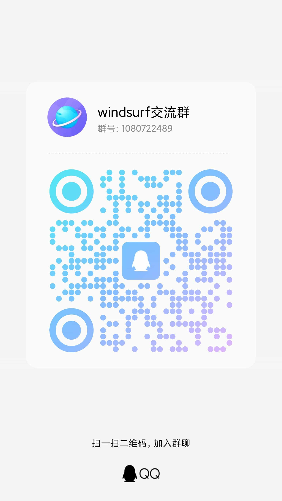

# 📱 Mobile MCP Agent

> Mobile AI Automation Testing Platform — MCP Tools + AI Agent + Visual Console

<div align="center">

[](https://pypi.org/project/mobile-mcp-ai/)
[](https://www.python.org/)
[](LICENSE)
[](https://developer.android.com/)
[](docs/iOS_SETUP_GUIDE.md)

**⭐ Find it useful? Give it a Star!**

**📱 Supports both Android and iOS**

[中文](README.md)

</div>

---

## 📖 Overview

Mobile MCP Agent is a mobile AI automation testing platform with three independently usable layers:

| Layer | Description | Tech Stack | Docs |
|:---:|------|------|:---:|
| **MCP Server** | 39 mobile automation tools, works standalone with Cursor / Claude | Python · MCP Protocol · PyPI | [MCP Docs](docs/MCP_README_EN.md) |
| **AI Agent** | Intelligent test execution engine with auto tool orchestration, paradigm fallback, result verification | LangChain · LangGraph | [Agent Docs](agent-app/README.md) |
| **Electron Console** | Visual interface for device preview, test orchestration, real-time operation logs | Electron · React · TailwindCSS | This document |

> **Just want to use MCP tools with Cursor / Claude?** See 👉 [MCP Usage Guide](docs/MCP_README_EN.md)

---

## 🎬 Demo

<div align="center">


*[Watch HD Video →](docs/videos/demo.mp4)*

</div>

<div align="center">


*Agent automated test execution*

</div>

---

## ✨ Key Features

<table>
<tr>
<td width="50%">

### 🧠 AI Agent Smart Execution

LangChain + LangGraph based test Agent, auto tool orchestration, step-by-step test case execution

</td>
<td width="50%">

### 🔄 Three-Paradigm Auto Fallback

Element interaction → SoM vision → Coordinate positioning, cascading fallback for maximum success rate

</td>
</tr>
<tr>
<td width="50%">

### 🖥️ Visual Console

Electron desktop app with real-time device preview, test flow orchestration, operation log timeline

</td>
<td width="50%">

### 🔧 Standalone MCP Tools

39 tools via `pip install mobile-mcp-ai`, works directly with Cursor / Claude

</td>
</tr>
<tr>
<td width="50%">

### 🎯 Dual Platform Support

Android + iOS, element tree + visual coordinate dual engines

</td>
<td width="50%">

### 🛡️ Smart Verification

Auto operation result verification, precondition checks, auto test report generation

</td>
</tr>
</table>

---

## 📱 Platform Support

| Platform | Status | System Requirements | Setup Guide |
|:---:|:---:|:---:|:---:|
| **Android** | ✅ Full Support | Windows / macOS / Linux | Out of the box |
| **iOS** | ✅ Full Support | macOS (required) | [iOS Setup Guide →](docs/iOS_SETUP_GUIDE.md) |

---

## 🏗️ Architecture

```
┌──────────────────────────────────────────────────────┐
│            Electron Console (frontend/)               │
│        React · TailwindCSS · Shadcn UI · oRPC        │
│   Device Preview · Test Orchestration · Chat · Logs   │
└──────────────────┬───────────────────────────────────┘
                   │ HTTP / SSE
┌──────────────────▼───────────────────────────────────┐
│              AI Agent (agent-app/)                     │
│     LangChain · LangGraph · FastAPI · SSE Stream      │
│  Orchestration · Fallback · Screenshot Opt · Retry    │
└──────────────────┬───────────────────────────────────┘
                   │ MCP Protocol (stdio)
┌──────────────────▼───────────────────────────────────┐
│            MCP Server (pip install mobile-mcp-ai)     │
│         39 Mobile Automation Tools · Android + iOS    │
└──────────────────┬───────────────────────────────────┘
                   │ ADB / WebDriverAgent
              📱 Mobile Device
```

---

## 🚀 Quick Start

### Prerequisites

| Tool | Purpose | Install |
|------|---------|---------|
| **Python 3.8+** | MCP Server & Agent | [python.org](https://www.python.org/) |
| **Node.js 18+** | Electron Console | [nodejs.org](https://nodejs.org/) |
| **pnpm** | Frontend package manager | `npm install -g pnpm` |
| **uv** | Agent dependency manager | `pip install uv` |
| **ADB** | Android device connection | Android SDK Platform Tools |
| **Git** | Source code | [git-scm.com](https://git-scm.com/) |

### Step 1: Clone the Project

```bash
git clone https://gitee.com/cong_wa/mobile-mcp.git
cd mobile-mcp
```

### Step 2: Connect Mobile Device

**Android:**
```bash
# Enable USB debugging on your phone, connect via USB cable
adb devices
# Device listed means connection is successful
```

**iOS:**
```bash
# Install dependencies
pip install tidevice facebook-wda
brew install libimobiledevice

# Check connection
tidevice list
```

> 📖 iOS requires WebDriverAgent setup, see [iOS Setup Guide](docs/iOS_SETUP_GUIDE.md)

### Step 3: Start MCP Server (SSE Mode)

Both Agent and Electron Console require MCP Server running in SSE mode:

```bash
# Install MCP Server
pip install mobile-mcp-ai

# Start in SSE mode (default port 3100)
mobile-mcp --sse
```

> 💡 In SSE mode, MCP Server serves at `http://localhost:3100/sse`

### Step 4: Start AI Agent Backend

```bash
cd agent-app

# Copy and edit config file
cp .env.example .env
# Edit .env, fill in LLM API Key (required)
```

Key `.env` configuration:

```bash
# LLM Config (required)
LLM_MODEL=openai:gpt-4o          # Model, format: provider:model
LLM_API_KEY=sk-xxx                # API Key
LLM_BASE_URL=https://api.openai.com/v1  # API endpoint

# Agent Server
AGENT_HOST=0.0.0.0
AGENT_PORT=8088
```

Start Agent:

```bash
# Install dependencies
uv sync

# Start Agent HTTP service
uv run uvicorn mobile_agent.api.app:app --host 0.0.0.0 --port 8088
```

The Agent will automatically connect to MCP Server via stdio.

### Step 5: Start Electron Console

```bash
cd frontend

# Install dependencies
pnpm install

# Start dev mode
pnpm start
```

The console connects to `http://localhost:8088/api/v1` by default. To change this, modify the backend address in the console's **Settings page**.

---

## ⚙️ Deployment Configuration

### Backend Service Address

The Electron Console needs to connect to the AI Agent backend. Configuration options (by priority):

| Method | Description | Use Case |
|--------|-------------|----------|
| **Console Settings Page** | Modify backend address in UI (saved to localStorage) | Most convenient, recommended |
| **Environment Variable** | Set `VITE_API_BASE` env var | Build-time configuration |
| **Default** | `http://localhost:8088/api/v1` | Local development |

**Settings Page (Recommended):**

Open Electron Console → Click "Settings" in sidebar → Modify configuration:
- **LLM Config**: Model, API Key, Base URL
- **MCP Server URL**: MCP Server SSE address (default `http://localhost:3100/sse`)
- **Agent Behavior**: Max iterations, System Prompt
- **Middleware**: Operation logger, screenshot optimization, retry strategy

**Environment Variable:**

```bash
# Specify backend address at build time
VITE_API_BASE=http://your-server:8088/api/v1 pnpm start
```

### Remote Deployment

If the Agent backend is deployed on a remote server:

```bash
# 1. Remote server: Start MCP Server
mobile-mcp --sse --host 0.0.0.0 --port 3100

# 2. Remote server: Start Agent
cd agent-app
uv run uvicorn mobile_agent.api.app:app --host 0.0.0.0 --port 8088

# 3. Local: Connect console to remote Agent
# In console Settings page, set backend address to: http://<remote-IP>:8088/api/v1
```

---

## 📁 Project Structure

```
mobile-mcp/
├── mcp_tools/              # MCP Server source
├── core/                   # MCP core modules (element locating, screenshots, device management)
├── mobile_mcp/             # PyPI package entry
├── agent-app/              # AI Agent backend
│   ├── src/mobile_agent/   # Agent source
│   │   ├── core/           # Agent core (config, MCP connection, agent builder)
│   │   ├── api/            # FastAPI endpoints
│   │   ├── prompts/        # System Prompt
│   │   ├── middleware/     # Middleware (logging, screenshot opt, retry)
│   │   └── cli/            # CLI interactive mode
│   └── .env.example        # Environment variables example
├── frontend/               # Electron Console
│   ├── src/                # React source
│   └── package.json
├── docs/                   # Documentation
│   ├── MCP_README.md       # MCP Usage Guide (Chinese)
│   ├── MCP_README_EN.md    # MCP Usage Guide (English)
│   ├── iOS_SETUP_GUIDE.md  # iOS Setup Guide
│   └── ...
├── config.py               # MCP Server configuration
├── env.example             # MCP Server env example
├── setup.py                # PyPI packaging config
├── requirements.txt        # MCP Server dependencies
└── README.md               # Main README (Chinese)
```

---

## 🔧 Using Components Independently

### MCP Server Only (with Cursor / Claude)

No Agent or Electron needed, use MCP tools directly:

```bash
pip install mobile-mcp-ai
```

See 👉 [MCP Usage Guide](docs/MCP_README_EN.md)

### Agent CLI Mode Only

No Electron Console needed, interact via command line:

```bash
cd agent-app
uv sync
uv run python -m mobile_agent.cli.interactive
```

```
🤖 Mobile Agent started, enter tasks to control the phone
👤 > Open WeChat and go to Moments
🤖 OK, I'll open WeChat and navigate to Moments...
```

---

## ❓ FAQ

### Q: Console can't connect to backend?

1. Confirm Agent is running and listening on the correct port (default `8088`)
2. Check backend address in console "Settings" page
3. For cross-machine deployment, ensure firewall allows the port

### Q: MCP Server can't connect to device?

- **Android**: Confirm `adb devices` shows your device, USB debugging is enabled
- **iOS**: Confirm `tidevice list` shows your device, WebDriverAgent is configured

### Q: Agent reports LLM connection failure?

Check `agent-app/.env` configuration:
- Is `LLM_API_KEY` correct?
- Is `LLM_BASE_URL` accessible?
- Click "Test Connection" in console Settings page to verify

---

## 📞 Contact

<div align="center">



*Join QQ Group (Group ID: 1080722489)*

</div>

---

## 🙏 Acknowledgments

The MCP tools part of this project is forked from [mobile-mcp](https://gitee.com/chang-xinping/mobile-mcp). Thanks to the original author for the open-source contribution!

## 📄 License

Apache 2.0

---

<div align="center">

[Gitee](https://gitee.com/cong_wa/mobile-mcp) · [GitHub](https://github.com/congwa/mobile-agent) · [PyPI](https://pypi.org/project/mobile-mcp-ai/)

**🚀 Making mobile testing easier**

</div>
